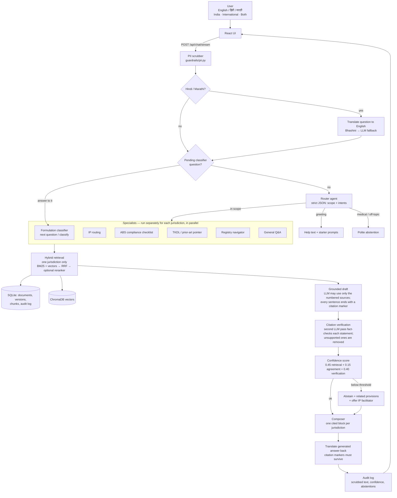

# AyuPramana — architecture

AyuPramana answers IP and regulatory questions about Ayurvedic products **only from a curated corpus of
official documents**, cites the exact provision and document version behind every statement, and abstains when
the evidence is weak. Everything below is plain Python / TypeScript with no agent framework, so each step can be
read and explained.

## Request flow

## Components

| Layer | Files | Responsibility |
|---|---|---|
| Config | `backend/app/config.py` | Every setting from `.env`, typed, in one place |
| Ingestion | `app/ingest/manifest.py`, `loaders.py`, `chunker.py`, `pipeline.py` | Validate the manifest; extract text from PDF/HTML/TXT; cut along legal headings (Section / Article / Rule / Schedule…); version files by SHA-256 hash |
| Storage | `app/db/models.py`, `repository.py`, `app/retrieval/vector_store.py` | SQLite is the source of truth for text and versions; Chroma holds vectors plus filter metadata |
| Retrieval | `app/retrieval/search.py`, `bm25.py`, `embeddings.py`, `reranker.py` | Hybrid search strictly within one jurisdiction; calibrated 0–1 relevance |
| LLM | `app/llm/` | One `complete()` interface over Groq, Ollama (both OpenAI-compatible) and Anthropic; retries on 429/5xx |
| Agents | `app/agents/router.py`, `ip_routing.py`, `abs_helper.py`, `tkdl_pointer.py`, `registry.py`, `formulation.py`, `general.py`, `composer.py`, `orchestrator.py` | Route, answer per specialist, merge, run a turn |
| Guardrails | `app/guardrails/pii.py`, `verification.py`, `confidence.py`, `messages.py` | PII masking, fact-checking, confidence, fixed (never LLM-written) disclaimer and abstention texts |
| Translation | `app/translate/` | Bhashini (config + compute calls) with LLM fallback; marker-safe |
| API | `app/main.py`, `schemas.py` | `/api/chat`, `/api/chat/stream`, `/api/escalate`, `/api/feedback`, `/api/sources`, `/api/admin/overview`, `/api/health` |
| Evaluation | `app/evaluation.py`, `scripts/eval.py` | Metrics and `docs/eval_report.md` |
| UI | `frontend/src/` | Chat with citation chips and source panel, jurisdiction toggle, language selector, Sources and Audit pages |

## How the four judging criteria are met

**1. Answer accuracy**
- The LLM sees only retrieved provisions and is told to reply `INSUFFICIENT_EVIDENCE` if they don't answer the question.
- Hybrid retrieval combines keyword and semantic search.
- A second LLM pass fact-checks each statement and removes unsupported ones.

**2. Citation correctness**
- Citation markers are validated against the sources actually supplied. Invented markers are dropped.
- Each citation carries the document title, section reference, jurisdiction, version date, file hash, page and official URL.
- Clicking a citation shows the exact source text.

**3. Safe abstention.** Answers are withheld and replaced by an abstention message plus related provisions when:
- the corpus is empty for that jurisdiction,
- nothing relevant is retrieved,
- the LLM finds the evidence insufficient,
- no valid citation remains,
- fewer than half of the statements pass the fact-check, or
- confidence falls under `CONFIDENCE_THRESHOLD`.

Medical/dosage and off-topic questions are declined outright. Personal legal-advice framing gets general information plus an escalation offer.

**4. Multilingual quality**
- Hindi and Marathi questions are searched through English, the corpus language.
- Answers are translated back with every citation marker preserved. A translation that changes a marker is rejected.
- Quoted source text stays in its official language.
- UI text, fixed messages and classifier questions exist in all three languages.

## Design decisions

- **Jurisdiction separation.** `Retriever.search` requires `india` or `international` and filters in both stores. "Both" runs two independent pipelines and returns two blocks.
- **No law is hard-coded:**
  - The corpus comes only from files the team places in `data/raw/`.
  - Classifier questions (`data/formulation_flow.yaml`) collect facts only; categories are decided from retrieved definitions.
  - Portal links (`data/registry_links.yaml`) are shown only when marked `verified: true`.
- **Versioning.** Re-ingesting a changed file creates a new version and retires the old chunks, which are kept for audit. Answers show which version they used.
- **Graceful degradation.** Without an LLM (no key, network down), the assistant quotes the most relevant provisions verbatim ("extractive" mode), still gated by retrieval confidence. Unverified answers are capped below "High" confidence.
- **Privacy (in the spirit of the DPDP Act, 2023):**
  - Only an anonymous, per-tab session id is kept.
  - Emails, phone numbers, Aadhaar-like, PAN-like and other long ID numbers are masked before the LLM call and before logging.
  - Classifier state lives in memory only and expires after 30 minutes.
  - Escalations store no contact details.
- **Prompt-injection defence:**
  - Retrieved text is labelled as data in every prompt, and the model is told to ignore instructions inside it.
  - Markdown is rendered without raw HTML.
  - Answers can only cite sources that were supplied.
- **Streaming.** `/api/chat/stream` sends progress events (routing → retrieving → writing → verifying → translating) and then the verified blocks. Answer text is deliberately not streamed token by token, because nothing is shown before it has been fact-checked.
